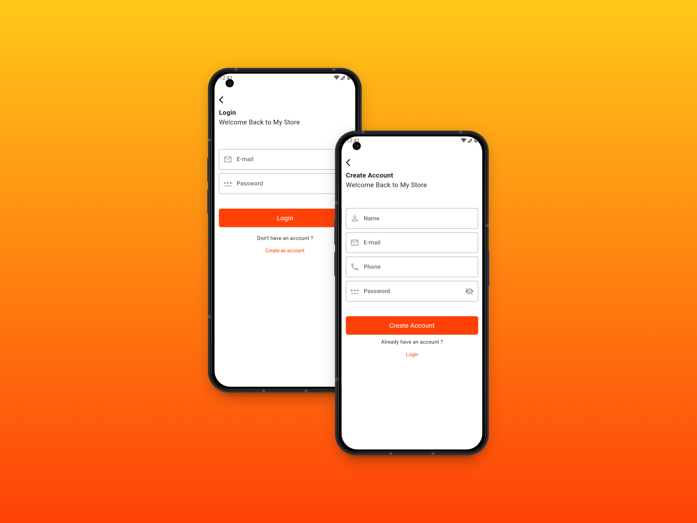
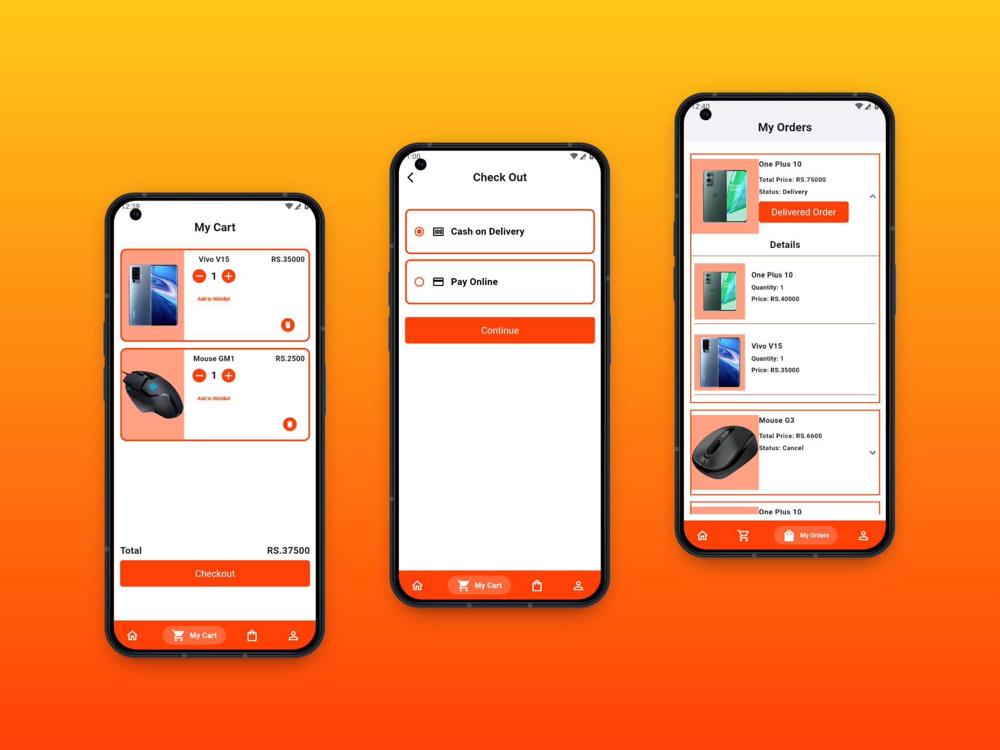
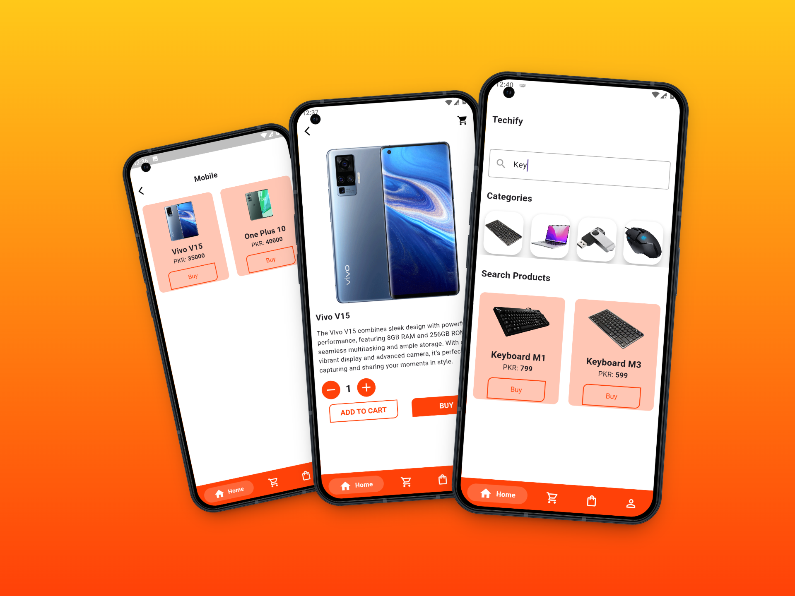
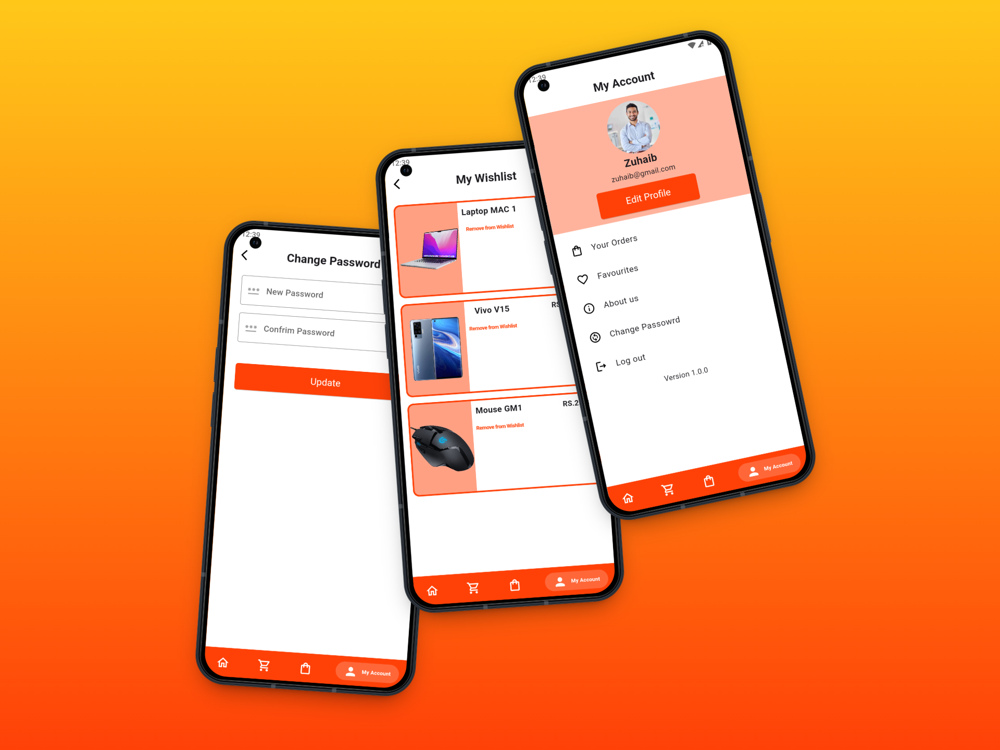

# 🛒 Techify – E-Commerce Mobile App (Flutter + Firebase)

A sleek, modern, and high-performance **E-Commerce mobile app** built using Flutter and Firebase — tailored for tech lovers.  
Shop a wide variety of tech products like **Mobiles, Laptops, Keyboards, Mouses, USBs**, and more — all in one app.

---

## 🚀 Features

- 🔐 **Firebase Authentication** (Email/Password)
- 🛍️ **Shop Tech Products** – Mobiles, Laptops, Accessories & more
- ❤️ **Wishlist Functionality**
- 🛒 **Add to Cart** & **Place Orders**
- 💳 **Cash on Delivery (COD)** available  
  *(Online Payment via Stripe coming soon...)*
- 🔍 **Search Products** directly from the Home screen
- 📦 **My Orders** – Track all your purchases
- 👤 **User Profile** – View profile & change password
- ✨ Smooth Navigation with **Persistent Bottom Navigation Bar**
- 🧠 Built with **Provider** for State Management
- ⚙️ Modern, Responsive & Clean UI/UX

---

## 📱 App Screens – Techify UI Mockups

> Discover how style meets functionality inside the **Techify App**.

 

<table width="100%" align="center" cellspacing="10">
  <tr>
    <td align="center" valign="top" style="border: 1px solid #ccc; padding: 15px;">
       
      <b>🏠 Home & Categories</b> 
      Search and browse trending tech products by category — fast and easy.
    </td>
    <td align="center" valign="top" style="border: 1px solid #ccc; padding: 15px;">
       
      <b>🔎 Product Details</b> 
      Get all product info — title, price, image, and description before adding to cart or wishlist.
    </td>
  </tr>
  <tr>
    <td align="center" valign="top" style="border: 1px solid #ccc; padding: 15px;">
       
      <b>🛒 Cart & Checkout</b> 
      View your cart items and place orders with Cash on Delivery (COD) option.
    </td>
    <td align="center" valign="top" style="border: 1px solid #ccc; padding: 15px;">
       
      <b>📦 My Orders & Wishlist</b> 
      Track orders, manage wishlist, and keep your tech items organized.
    </td>
  </tr>
  <tr>
    <td colspan="2" align="center" valign="top" style="border: 1px solid #ccc; padding: 15px;">
       
      <b>👤 User Profile & Settings</b> 
      View account info, change password, and manage your app settings.
    </td>
  </tr>
</table>

  <i>⚡ Shop smarter, faster, and more intuitively — with Techify in your pocket.</i>

---

## 📦 Tech Stack

- **Flutter** – Cross-platform UI framework  
- **Dart** – Programming language  
- **Firebase** – Auth, Firestore, and Storage  
- **Provider** – State management  
- **Stripe (Flutter Stripe)** – For upcoming online payment  
- **VS Code** – Development environment  

---

## 📁 Folder Structure (Core)

<!-- # techify

A new Flutter project.

## Getting Started

This project is a starting point for a Flutter application.

A few resources to get you started if this is your first Flutter project:

- [Lab: Write your first Flutter app](https://docs.flutter.dev/get-started/codelab)
- [Cookbook: Useful Flutter samples](https://docs.flutter.dev/cookbook)

For help getting started with Flutter development, view the
[online documentation](https://docs.flutter.dev/), which offers tutorials,
samples, guidance on mobile development, and a full API reference. -->
